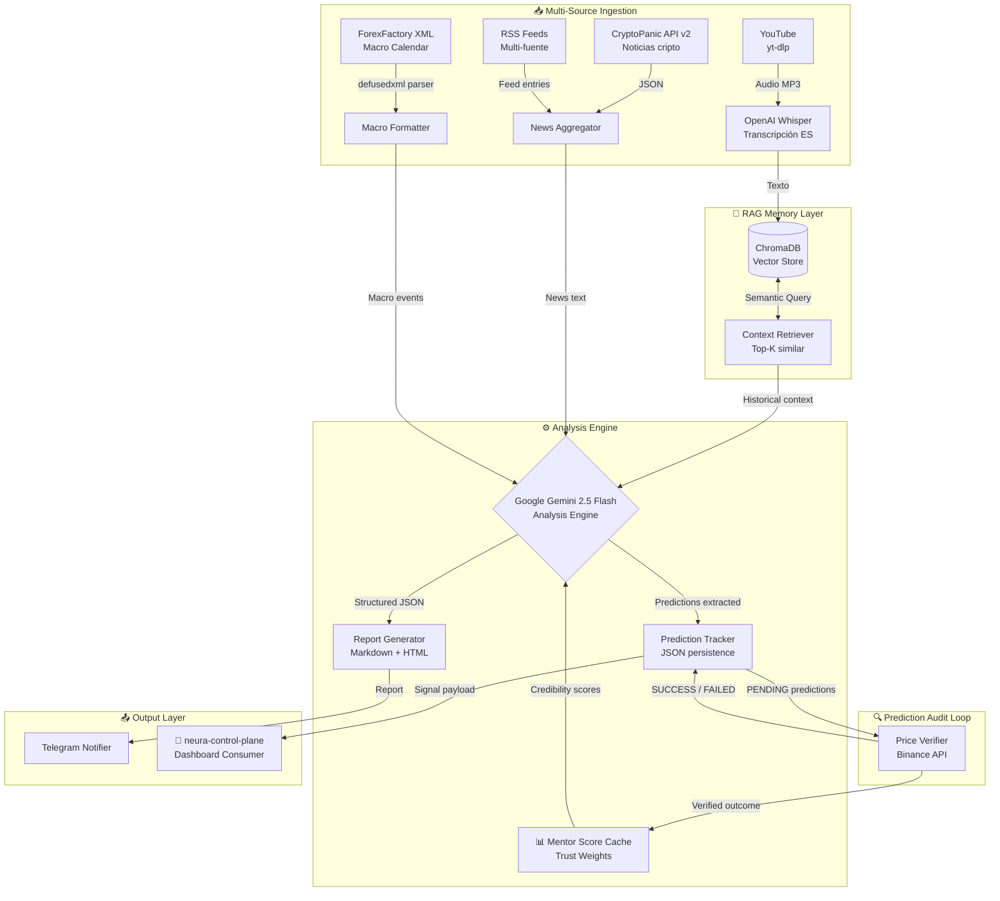

# Fundamental Intelligence Hub 🧠

**Portfolio Showcase Version** — Pipeline de Inteligencia RAG para Mercados Financieros.

> *"No resumir. Auditar."* — El sistema no sintetiza opiniones: las pondera por track record histórico verificado, las contrasta con datos macro y emite un dictamen propio.

## Descripción General

Fundamental Intelligence Hub es un sistema autónomo de análisis de mercado que ingesta datos de **múltiples fuentes heterogéneas** — videos de YouTube, noticias cripto, calendario macroeconómico y métricas on-chain — y los transforma en señales de trading estructuradas mediante una arquitectura **RAG (Retrieval-Augmented Generation)** sobre **Google Gemini 2.5 Flash**.

El sistema no solo analiza: **audita**. Cada predicción emitida por los analistas monitoreados queda registrada y verificada contra el precio real en Binance, construyendo un score de credibilidad dinámico que retroalimenta la ponderación del análisis siguiente.

## Arquitectura del Sistema

```mermaid
graph TD
    subgraph Ingest["📥 Multi-Source Ingestion"]
        I1[YouTube<br/>yt-dlp] -->|Audio MP3| I2[OpenAI Whisper<br/>Transcripción ES]
        I3[CryptoPanic API v2<br/>Noticias cripto] -->|JSON| I4[News Aggregator]
        I5[RSS Feeds<br/>Multi-fuente] -->|Feed entries| I4
        I6[ForexFactory XML<br/>Macro Calendar] -->|defusedxml parser| I7[Macro Formatter]
    end

    subgraph Memory["🧠 RAG Memory Layer"]
        I2 -->|Texto| M1[(ChromaDB<br/>Vector Store)]
        M1 <-->|Semantic Query| M2[Context Retriever<br/>Top-K similar]
    end

    subgraph Analysis["⚙️ Analysis Engine"]
        M2 -->|Historical context| A1{Google Gemini 2.5 Flash<br/>Analysis Engine}
        I4 -->|News text| A1
        I7 -->|Macro events| A1
        SC[📊 Mentor Score Cache<br/>Trust Weights] -->|Credibility scores| A1
        A1 -->|Structured JSON| A2[Report Generator<br/>Markdown + HTML]
        A1 -->|Predictions extracted| A3[Prediction Tracker<br/>JSON persistence]
    end

    subgraph Audit["🔍 Prediction Audit Loop"]
        A3 -->|PENDING predictions| PV[Price Verifier<br/>Binance API]
        PV -->|Verified outcome| SC
        PV -->|SUCCESS / FAILED| A3
    end

    subgraph Output["📤 Output Layer"]
        A2 -->|Report| TG[Telegram Notifier]
        A3 -->|Signal payload| EXT[🔗 neura-control-plane<br/>Dashboard Consumer]
    end
```

## Key Engineering Highlights

### Mentor Trust Score — Feedback Cerrado

El sistema asigna a cada analista un **score de credibilidad dinámico** basado en predicciones verificadas.

### Pipeline Dual: Full Cycle + Fast Path

- **Full Cycle** (~30 min): Descarga videos, transcribe, analiza con RAG completo, genera reporte HTML.
- **Fast Path** (~5 min): Solo noticias + métricas rápidas → señal de urgencia si hay evento crítico.

### RAG con ChromaDB

Transcripciones anteriores se almacenan como embeddings en ChromaDB. En cada análisis, el sistema recupera el contexto semántico más relevante de los últimos días para que Gemini detecte **consistencias y contradicciones**.

## Stack Técnico

| Capa | Tecnología |
|------|-----------|
| LLM | Google Gemini 2.5 Flash |
| Transcripción | OpenAI Whisper (base model, ES) |
| Vector DB | ChromaDB (PersistentClient) |
| Descarga de video | yt-dlp |
| HTTP resiliente | requests + tenacity |
| Parsing XML seguro | defusedxml |
| Noticias | CryptoPanic API v2, feedparser (RSS) |
| Macro | ForexFactory XML Calendar |
| Precios | Binance REST API |

## Privacy & IP Notice

> Showcase Version: This repository contains a sanitized version of the production system.
>
> - **Excluded**: Proprietary alpha-generation prompts, live API keys, and specific source configurations.
> - **Included**: Architectural patterns, orchestration logic, and data structures.
