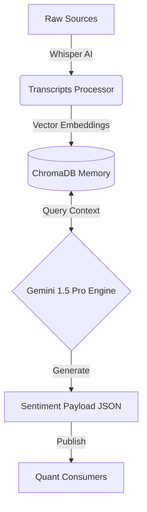

# Fundamental Intelligence Hub 🧠

**Portfolio Showcase Version** - Arquitectura de Inteligencia RAG para Mercados Financieros.

## 📋 Descripción General
Este servicio actúa como un Hub de Inteligencia Centralizado que procesa grandes volúmenes de datos no estructurados (Big Data) mediante técnicas de **RAG (Retrieval-Augmented Generation)** y modelos **Gemini 1.5 Pro**. El sistema transforma "ruido" (noticias, videos, reportes) en "señales" cuantitativas estructuradas.

## 🏗️ Arquitectura del Sistema

El flujo de datos sigue un pipeline estricto de ETL y Enriquecimiento Semántico:

## 🚀 Key Engineering Highlights

Este repositorio demuestra la implementación de patrones avanzados de Ingeniería de Software e IA:

*   **Vector Persistence Layer**: Implementación de **ChromaDB** para almacenar embeddings de transcripciones, permitiendo al bot tener "memoria de largo plazo" y comparar el contexto actual con eventos históricos similares.
*   **Analyst Scoring Loop**: Sistema de retroalimentación que guarda las predicciones en vectores y las valida contra el precio futuro real para ajustar la confianza del modelo automáticamente.
*   **Strict Data Contracts**: Uso de **Pydantic** para definir esquemas rigurosos (`SentimentPayload`), asegurando que la integración con sistemas externos sea robusta y libre de errores de tipo.

## 🛡️ Privacy & IP Notice

> **Showcase Version**: This repository contains a sanitized version of the production system used for R&D. 
>
> *   **Excluded**: Proprietary alpha-generation prompts, live API keys, and specific source configurations.
> *   **Included**: Architectural patterns, orchestration logic, and data structures.
> *   **Purpose**: To demonstrate proficiency in building scalable AI-driven financial systems.

## 🛠️ Tech Stack
*   **Core**: Python 3.10+
*   **AI/LLM**: Google Gemini 1.5 Pro, OpenAI Whisper
*   **Database**: ChromaDB (Vector), SQLite (Metadata)
*   **Validation**: Pydantic v2
